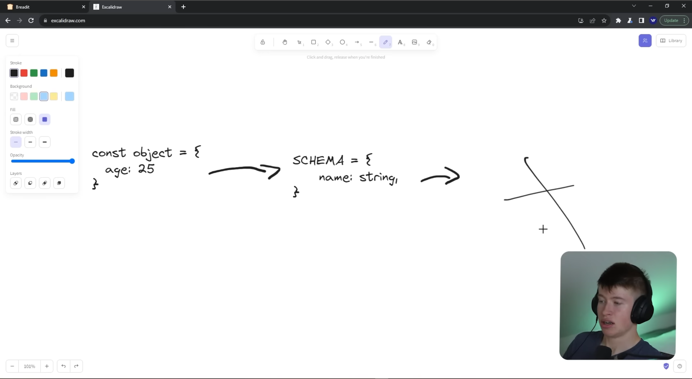

# Reddit Clone

## Welcome to our Reddit Clone project!

This web application replicates the core functionalities of the popular social platform, Reddit. Engage in discussions, share content, and discover a community-driven experience.

## Features

- **User Authentication:** Create an account or log in securely to participate in the community.
- **Post Content:** Share links, text posts, and images to spark conversations.
- **Upvoting and Downvoting:** Express your opinion on posts and comments.
- **Comment Threads:** Engage in discussions by commenting on posts or replies.
- **Subreddit System:** Explore and create specialized communities based on interests.
- **Responsive Design:** Enjoy a seamless experience across devices.

## Getting Started

1. **Clone the Repository:**
   ```bash
   git clone https://github.com/arepaflipper/reddit-clone.git
   cd reddit-clone

2. **Install Dependencies:**
   ```bash
   yarn install
   ```

3. Install the prisma LSP for **Neovim**:
   ```bash
   :TSInstall prisma

## Database Diagram


### (0:11:12) Build the Navbar
visit the UI library `https://ui.shadcn.com/docs/components/button` to use the button component

Run:
```bash
npx shadcn-ui add button
```

The file `./src/lib/db.ts` ensures that while we're on local development
we won't install multiple prisma clients, but instead we use a cached one.

The file `./src/lib/utils.ts` are some definitions that would be annoying to type one by one.

The file `./src/app/layout.tsx` is a file generated by `next.js`, even if we delete it `next.js` will still generate it.

### (0:16:00) twMerge
it is a helper for tailwindcss to combine multiple classNames like:
```
my-2 mx-2 -> m-2 
```

### (0:23:00) container className
There are definitions in the `./tailwind.config.js` file. The `container` className is defined there.

### (0:51:55) import toast from shadcn-ui
Run the following command:

### (0:55:09) Press login button
This behaves different from the Joshua example. It should redirect to
`http://localhost:3000/api/auth/error` because we didn't provide the "toast" 
to be rendered anywhere on the page.

### (1:18:52) Authentication
The following helper:
```tsx
export const getAuthSession = () => getServerSession(authOptions)
```
It is going to be useful across the entire application and we can use this for example in the nav bar
by turning the Navbar into a server component into an asynchronous server component ,that means, that
we can now perform awaiting actions at the top level of the navbar, for example fetch the session data.

### (1:23:07) add dropdown menu
Run the following command:


```bash
npx shadcn-ui add 
```
Select the `dropdown menu` and hit space or right arrow `→`.

```bash
❯ npx shadcn-ui init
✔ Would you like to use TypeScript (recommended)? … no / yes
✔ Which style would you like to use? › Default
✔ Which color would you like to use as base color? › Stone
✔ Where is your global CSS file? … src/styles/globals.css
✔ Would you like to use CSS variables for colors? … no / yes
✔ Where is your tailwind.config.js located? … tailwind.config.js
✔ Configure the import alias for components: … src/components
✔ Configure the import alias for utils: … src/lib/utils.ts
✔ Are you using React Server Components? … no / yes
✔ Write configuration to components.json. Proceed? … yes

✔ Writing components.json...
✔ Initializing project...
✔ Installing dependencies...

Success! Project initialization completed.

npx shadcn-ui add toast
```

### (1:40:44) Routing
Add the following file into the project:`src/app/@authModal/default.tsx`:

- The `@` is a convention for how we can create these routes intercepting and parallel routes.

- The `default.tsx` determines what should be shown from this component, if no route is able to
be intercepted, so it is a kind of default state for the routes. In this case is `null` because 
we don't want to render anything, if we are not intercepting a route. (Q: why not a 404 page?)

### (1:41:00) ignore the typescript warning:
`TypeScript` does not know how to deal with the `Navbar` asynchronous behavior, so we 
append `{/* @ts-expect-error Server Component */}` to ignore the issue. 

### (1:42:25) Intercept routes
Add the file `src/app/@authModal/(.)sign-in/page.tsx`:
- `(.)` like a file system 
- `(.)<route_to_intercept>` Whenever we call the route `/sign-in` we will intercept it in the
auth modal. 
- `(.)<route_to_intercept>/<what_to_render>` Whenever the interception is successful we will render
the component `page.tsx`.

### (1:46:00) Route interceptor
Instead of actually navigating the user to a page, sometimes, when they're not expecting it,
so for example, if the user click the Vault button on a comment and they have to Login to do that
you could just send them to the auth modal, which is not invasive compared to actually navigate the 
user to the proper page (like `/sign-in`).

### (2:16:46) Create the route '/r/'
The folders created into the `src/app/` folder are going to be considered as routes.

### (2:29:46) Use `zod` library
The `zod` library is used to validate the data that is going to be sent to the server.
In this case we are going to validate the data to create the proper community.


In case we are not passing data according to the schema, the `zod` library will throw an error:



### (2:59:00) \[slug]
The square brackets in the folder defines a dynamic route which its value is taken from the URL.
eg. `http://localhost:3000/r/neovim` for this case and considering that the folder's path is 
`src/app/r/[slug]/page.tsx`, we can find the string `neovim` into the `params.slug` property.

### (3:25:36) Double exclamation mark
The double exclamation mark is used in JavaScript to turn a value into a boolean.

### (3:36:38)(4:07:55)(5:54:00)(7:34:30) "use client"
The `use client` is used to make sure that the code is only executed on the client side. 
And it allows us to use client API's

### (4:38:40) Upload images
I made the code refactor based on this doc:


### (4:41:00) Focus the `<TextAreaAutosize/>` component
The component takes the `ref` and so it can

```tsx
  const _titleRef = useRef<HTMLTextAreaElement>(null);
  ...
          <TextAreaAutosize ref={_titleRef} {...register('title')} />
  ...
```
The code above will throw the warning bellow:
```
Diagnostics:
1. 'ref' is specified more than once, so this usage will be overwritten. [2783]
```
Which is problematic because the `form` already takes the `ref` and so it can 
handle like automatic focus. The `<TextAreaAutosize/>` component does all this `ref` for
us under the hood. So, in order to fix this case is share the `ref` with **react hook form**.

### (5:02:52) Prisma studio
To run the Prisma studio, just run `npx prisma studio`, select `Post` model, there 
should be the created posts.

### (5:31:30) Extended Types
```tsx
  type TPost = {
    subredditName: string;
    post: Post & {
      author: User;
      votes: Vote[];
    }
  }
```

### (7:34:30) 

### Acknowledgements
Special thanks to Joshua Neske (@joshtriedcoding) for making the original project tutorial.
